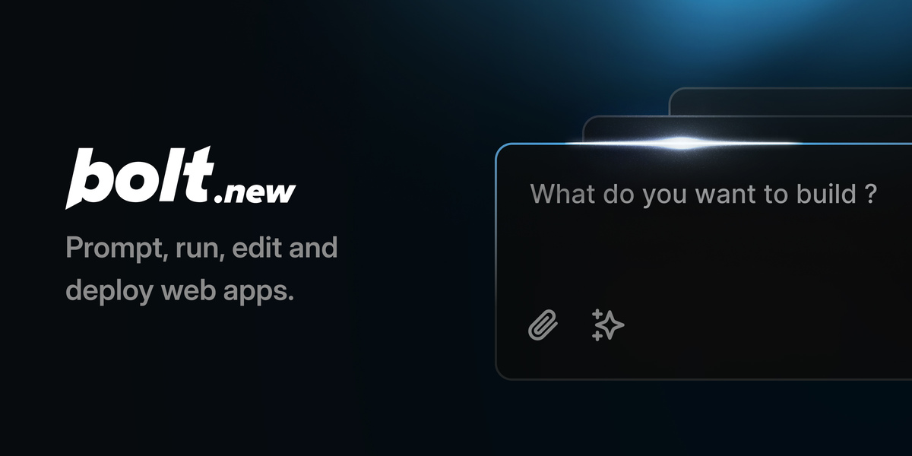

[](https://bolt.new)

# Bolt.new Fork by Cole Medin - oTToDev

这个 Bolt.new (oTToDev) 的分支版本允许您为每个提示词选择不同的LLM模型！目前，您可以使用 OpenAI、Anthropic、Ollama、OpenRouter、Gemini、LMStudio、Mistral、xAI、HuggingFace、DeepSeek 或 Groq 模型 - 而且可以轻松扩展以支持 Vercel AI SDK 支持的任何其他模型！请参阅以下说明在本地运行并扩展更多模型。

## 加入 oTToDev 社区！

https://thinktank.ottomator.ai

## 此分支的功能请求 - 欢迎贡献！！

- ✅ OpenRouter 集成 (@coleam00)
- ✅ Gemini 集成 (@jonathands)
- ✅ 从已下载的模型自动生成 Ollama 模型 (@yunatamos)
- ✅ 按提供商筛选模型 (@jasonm23)
- ✅ 将项目下载为 ZIP (@fabwaseem)
- ✅ 改进 `app\lib\.server\llm\prompts.ts` 中的主要 Bolt.new 提示词 (@kofi-bhr)
- ✅ DeepSeek API 集成 (@zenith110)
- ✅ Mistral API 集成 (@ArulGandhi)
- ✅ "OpenAI Like" API 集成 (@ZerxZ)
- ✅ 支持文件同步（单向同步）到本地文件夹 (@muzafferkadir)
- ✅ 使用 Docker 容器化应用程序以便于安装 (@aaronbolton)
- ✅ 直接发布项目到 GitHub (@goncaloalves)
- ✅ 在 UI 中输入 API 密钥的功能 (@ali00209)
- ✅ xAI Grok Beta 集成 (@milutinke)
- ✅ LM Studio 集成 (@karrot0)
- ✅ HuggingFace 集成 (@ahsan3219)
- ✅ Bolt 终端查看 LLM 运行命令的输出 (@thecodacus)
- ✅ 代码输出流式传输 (@thecodacus)
- ✅ 恢复代码到早期版本的功能 (@wonderwhy-er)
- ✅ Cohere 集成 (@hasanraiyan)
- ✅ 动态模型最大令牌长度 (@hasanraiyan)
- ✅ 提示词缓存 (@SujalXplores)
- ✅ **高优先级** - 将本地项目加载到应用程序中 (@wonderwhy-er)
- ⬜ **高优先级** - 即将完成 - 为提示词附加图片 (@atrokhym)
- ⬜ **高优先级** - 减少 Bolt 重写文件的频率（文件锁定和差异）
- ⬜ **高优先级** - 为较小的 LLM 提供更好的提示（代码窗口有时不启动）
- ⬜ **高优先级** - 在后端运行代理而不是单个模型调用
- ⬜ 移动端友好
- ⬜ Together 集成
- ⬜ Azure OpenAI API 集成
- ⬜ Perplexity 集成
- ⬜ Vertex AI 集成
- ⬜ 直接部署到 Vercel/Netlify/其他类似平台
- ⬜ 更好的提示词增强
- ⬜ 让 LLM 在 MD 文件中规划项目以获得更好的结果/透明度
- ⬜ VSCode 集成，具有类似 git 的确认功能
- ⬜ 上传文档以获取知识 - UI 设计模板、参考编码风格的代码库等
- ⬜ 语音提示

## Bolt.new：浏览器中的AI驱动全栈Web开发

Bolt.new 是一个 AI 驱动的 Web 开发代理，允许您直接在浏览器中提示、运行、编辑和部署全栈应用程序——无需本地设置。如果您想使用 Bolt 开源代码库构建自己的 AI 驱动的 Web 开发代理，[点击这里开始！](./CONTRIBUTING.md)

## Bolt.new 的与众不同之处

Claude、v0 等都很出色，但您无法安装包、运行后端或编辑代码。这就是 Bolt.new 的优势所在：

- **浏览器中的全栈开发**：Bolt.new 将前沿 AI 模型与由 **StackBlitz 的 WebContainers** 提供支持的浏览器内开发环境集成。这使您能够：
  - 安装和运行 npm 工具和库（如 Vite、Next.js 等）
  - 运行 Node.js 服务器
  - 与第三方 API 交互
  - 从聊天中部署到生产环境
  - 通过 URL 分享您的作品

- **具有环境控制的 AI**：与传统开发环境中 AI 只能辅助代码生成不同，Bolt.new 赋予 AI 模型对整个环境的**完全控制**，包括文件系统、node 服务器、包管理器、终端和浏览器控制台。这使 AI 代理能够处理从创建到部署的整个应用程序生命周期。

无论您是经验丰富的开发人员、产品经理还是设计师，Bolt.new 都能让您轻松构建生产级全栈应用程序。

对于有兴趣使用 WebContainers 构建自己的 AI 驱动开发工具的开发人员，请查看此仓库中的开源 Bolt 代码库！

## 设置

许多人都是第一次从 Github 安装软件。如果您在安装过程中遇到任何问题，请使用上面的链接提交"问题"，或者随时通过分叉、编辑说明并提交拉取请求来改进此文档。

1. 从 https://git-scm.com/downloads 安装 Git

2. 从 https://nodejs.org/en/download/ 安装 Node.js

安装完成后请注意安装程序的提示。

在所有操作系统上，Node.js 的路径应该会自动添加到您的系统路径中。但如果您想确认，可以检查您的路径。在 Windows 上，您可以在系统中搜索"编辑系统环境变量"，在系统属性中选择"环境变量..."，然后在"Path"系统变量中检查 Node 的路径。在 Mac 或 Linux 机器上，它会提示您检查 /usr/local/bin 是否在您的 $PATH 中。要确定 usr/local/bin 是否包含在 $PATH 中，请打开终端并运行：

```
echo $PATH .
```

如果在输出中看到 usr/local/bin，那就没问题了。

3. 通过打开终端窗口（或在 Windows 中使用管理员权限的 CMD）并输入以下命令来克隆仓库（如果您还没有这样做）：

```
git clone https://github.com/coleam00/bolt.new-any-llm.git
```

3. 将 .env.example 重命名为 .env.local 并添加您的 LLM API 密钥。在 Mac 上，您可以在 "[your name]/bold.new-any-llm/.env.example" 找到此文件。Windows 和 Linux 的路径类似。


如果您看不到上面指示的文件，很可能是因为您无法查看隐藏文件。在 Mac 上，打开终端窗口并输入以下命令。在 Windows 上，您可以在文件资源管理器设置中看到隐藏文件选项。如果您在这里遇到困难，快速搜索 Google 就能帮助您。

```
defaults write com.apple.finder AppleShowAllFiles YES
```

**注意**：您只需要设置您想要使用的模型的 API 密钥，而 Ollama 不需要 API 密钥，因为它在您的计算机上本地运行：

在这里获取您的 GROQ API 密钥：https://console.groq.com/keys

按照以下说明获取您的 OpenAI API 密钥：https://help.openai.com/en/articles/4936850-where-do-i-find-my-openai-api-key

在账户设置中获取您的 Anthropic API 密钥：https://console.anthropic.com/settings/keys

```
GROQ_API_KEY=XXX
OPENAI_API_KEY=XXX
ANTHROPIC_API_KEY=XXX
```

可选地，您可以设置调试级别：

```
VITE_LOG_LEVEL=debug
```

如果使用 Ollama，请设置 DEFAULT_NUM_CTX，下面的示例使用 8K 上下文，并在 localhost 端口 11434 上运行 ollama：

```
OLLAMA_API_BASE_URL=http://localhost:11434
DEFAULT_NUM_CTX=8192
```

**重要提示**：永远不要将您的 `.env.local` 文件提交到版本控制中。它已经包含在 .gitignore 中。

## 使用 Docker 运行

前提条件：

如上所述安装 Git 和 Node.js，以及 Docker：https://www.docker.com/

### 1a. 使用辅助脚本

提供了 NPM 脚本以方便构建：

```bash
# 开发构建
npm run dockerbuild

# 生产构建
npm run dockerbuild:prod
```

### 1b. 直接 Docker 构建命令（作为使用 NPM 脚本的替代方案）

如果您愿意，可以使用 Docker 的 target 功能来指定构建环境，而不是使用 NPM 脚本：

```bash
# 开发构建
docker build . --target bolt-ai-development

# 生产构建
docker build . --target bolt-ai-production
```

### 2. 使用配置文件运行容器的 Docker Compose

使用 Docker Compose 配置文件管理不同的环境：

```bash
# 开发环境
docker-compose --profile development up

# 生产环境
docker-compose --profile production up
```

当您使用开发配置文件运行 Docker Compose 命令时，您在机器上对代码所做的任何更改都会自动反映在容器上运行的站点中（即热重载仍然有效！）。

## 不使用 Docker 运行

1. 使用终端（或在 Windows 中使用管理员权限的 CMD）安装依赖项：

```
pnpm install
```

如果您收到类似"command not found: pnpm"的错误，那意味着没有安装 pnpm。您可以通过以下方式安装它：

```
sudo npm install -g pnpm
```

2. 使用以下命令启动应用程序：

```bash
pnpm run dev
```

## 添加新的 LLM：

要在此版本的 Bolt.new 中使用新的 LLM，请转到 `app/utils/constants.ts` 并找到常量 MODEL_LIST。此数组中的每个元素都是一个对象，具有模型 ID 作为名称（从提供商的 API 文档中获取）、前端模型下拉列表的标签和提供商。

默认情况下，已实现了 Anthropic、OpenAI、Groq 和 Ollama 作为提供商，但如果您愿意，此仓库的 YouTube 视频介绍了如何扩展以使用更多提供商！

当您将新模型添加到 MODEL_LIST 数组时，它将在您本地运行应用程序或重新加载时立即可用。对于 Ollama 模型，请确保在尝试在此处使用之前已安装该模型！

## 可用脚本

- `pnpm run dev`：启动开发服务器。
- `pnpm run build`：构建项目。
- `pnpm run start`：使用 Wrangler Pages 在本地运行构建的应用程序。此脚本使用 `bindings.sh` 设置必要的绑定，因此您无需复制环境变量。
- `pnpm run preview`：构建项目并在本地启动，用于测试生产构建。注意，HTTP 流式传输目前在 `wrangler pages dev` 中无法按预期工作。
- `pnpm test`：使用 Vitest 运行测试套件。
- `pnpm run typecheck`：运行 TypeScript 类型检查。
- `pnpm run typegen`：使用 Wrangler 生成 TypeScript 类型。
- `pnpm run deploy`：构建项目并部署到 Cloudflare Pages。

## 开发

要启动开发服务器：

```bash
pnpm run dev
```

这将启动 Remix Vite 开发服务器。如果您使用 Chrome，您需要 Google Chrome Canary 才能在本地运行！这是一个简单的安装，而且也是一个很好的 Web 开发浏览器。

## 常见问题

### 如何获得 oTToDev 的最佳结果？

- **明确指定您的技术栈**：如果您想使用特定的框架或库（如 Astro、Tailwind、ShadCN 或任何其他流行的 JavaScript 框架），请在初始提示中提及它们，以确保 Bolt 相应地搭建项目。

- **使用增强提示图标**：在发送提示之前，尝试点击"增强"图标，让 AI 模型帮助您完善提示，然后在提交之前编辑结果。

- **先搭建基础，再添加功能**：在深入更高级的功能之前，确保应用程序的基本结构已就位。这有助于 oTToDev 理解您项目的基础，并确保在构建更高级功能之前一切都正确连接。

- **批量处理简单指令**：通过将简单指令合并到一条消息中来节省时间。例如，您可以让 oTToDev 更改配色方案、添加移动端响应式设计并重启开发服务器，一次性完成所有操作，从而显著节省时间并减少 API 信用消耗。

### 如何为 oTToDev 做贡献？

[请在此处查看我们专门的 oTToDev 贡献页面！](CONTRIBUTING.md)

### 您计划将 oTToDev 合并回官方 Bolt.new 仓库吗？

下个月初将有更多消息 - 敬请关注！ 